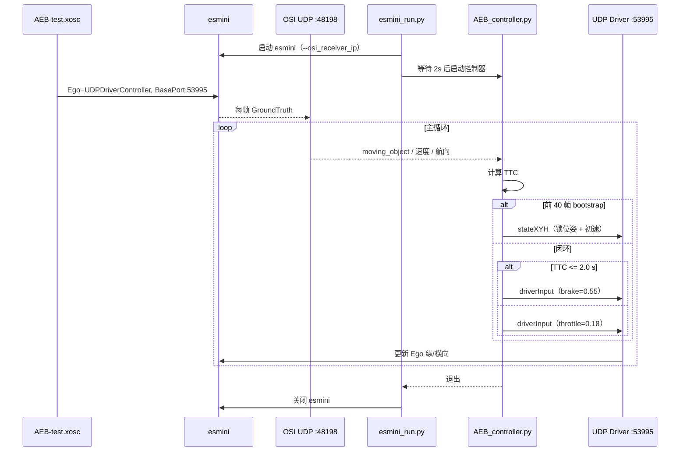

# mygit — esmini AEB 闭环仿真

本仓库用于在 **esmini v3.0.3** 中跑通 **AEB（自动紧急制动）** 外部控制链路：场景内 Ego 由 `UDPDriverController` 接管，Python 控制器通过 **OSI 读状态 + UDP 发控制** 实现 TTC 触发制动。

**当前状态（2026-06-10）：**

- **esmini_operator**：`sim_eval` 环境下 TTC-AEB 最小闭环已验证。
- **esmini_planning**：P0–P4 已接通；`car_gl_t6` 车模 + 4 个 planning 场景；控制层 v2（轨迹制动 + TTC 兜底，`max_brake=1.0`）。详见 [esmini_planning/README.md](./esmini_planning/README.md) 与 [INTEGRATION.md](./esmini_planning/INTEGRATION.md)。

---

## 快速开始（推荐）

```bash
source ~/anaconda3/etc/profile.d/conda.sh
conda activate sim_eval

cd /home/xs/桌面/git/mygit
python esmini_operator/esmini_run.py --initial-speed-ms 33.33
```

- 自动启动 esmini（`AEB-test.xosc` + OSI），等待 2 秒后运行 `Controllers/AEB_controller.py`
- 控制器跑完或达到 `--max-loops`（默认 4000）后，esmini 窗口自动关闭
- 终端应持续打印 `TTC: x.xx seconds`；威胁出现时出现 `TTC <= 2.0 s, brake`

不加 `--initial-speed-ms` 时，控制器使用默认初速 20 m/s；场景参数 `EgoSpeed=120` km/h 时建议传 **33.33**。

---

## 环境依赖

| 项目 | 说明 |
|------|------|
| **conda 环境** | `sim_eval`（`/home/xs/anaconda3/envs/sim_eval`，Python 3.11） |
| **protobuf** | `3.20.2`（与 esmini `udp_osi_common` / OSI 解析一致） |
| **esmini** | 预编译包，无需单独编译：`esmini-demo_Linux/esmini-demo/bin/esmini` |

仓库内**没有** `environment.yml`；若不用 conda，需自行保证 Python 3 + `protobuf==3.20.2`。

---

## 目录结构

```
mygit/
├── Controllers/
│   ├── AEB_controller.py           # AEB 主控制器（OSI + UDP 闭环）
│   └── Send_udp_driver_control.py  # UDP 单次发送示例（调试用）
├── esmini-demo_Linux/esmini-demo/  # esmini v3.0.3 预编译包
│   ├── bin/esmini
│   ├── resources/xosc/AEB-test.xosc
│   └── scripts/udp_driver/udp_osi_common.py
├── esmini_operator/                # 最小 AEB 闭环（TTC，sim_eval + esmini_run.py）
│   ├── esmini_run.py
│   ├── test_runs/
│   └── reports/
├── esmini_planning/                # 正式 Planning 接入（Python 3.10，与 operator 隔离）
│   ├── planning_controller.py
│   ├── run_planning.sh
│   ├── README.md
│   └── INTEGRATION.md              # Planning 被测 channel 矩阵
├── xmap/                           # OpenDRIVE 路网（planning 场景用）
├── xsscenarios/                    # OpenSCENARIO 场景库 + car_gl_t6
├── xs_metrics/                     # 规控评测（Perfect Control，与 UDP 闭环独立）
├── log.txt
├── README.md
└── changelog.md
```

---

## AEB 控制链路

### 数据流



### 关键参数

| 项目 | 值 |
|------|-----|
| 场景 | `esmini-demo_Linux/esmini-demo/resources/xosc/AEB-test.xosc` |
| esmini 可执行文件 | `esmini-demo_Linux/esmini-demo/bin/esmini` |
| 控制器 | `Controllers/AEB_controller.py` |
| UDP Driver BasePort | **53995**（Ego object_id=0） |
| OSI 接收端口 | **48198** |
| Bootstrap | 前 **40** 帧注入初速；默认 **20 m/s**，120 km/h 场景用 **33.33 m/s** |
| AEB 阈值 | TTC **≤ 2.0 s** → 制动 **0.55**，否则巡航油门 **0.18** |

### TTC 计算

- 在 Ego 航向坐标系下，找同车道前方最近目标（纵向 > 0，\|横向\| ≤ 2 m）
- `gap = 纵向净距 - 5 m`；`closing = ego_along - target_along`
- `TTC = gap / closing`；无威胁时返回 `inf`

### 场景时间线（默认参数）

| 仿真时间 (s) | 事件 |
|-------------|------|
| 0 | Ego s=20，Target s=100，Target 初速 30 km/h |
| 5 | Target 第一次变道 |
| 7 | Target 第二次变道 |
| 11 | Target 第一次制动 |
| 17 | Target 加速至 80 km/h |
| 20 | Target 第二次制动至 25 km/h |
| ~32 | 场景结束 |

---

## 运行方式

### 方式一：一键跑（日常推荐）

在 `mygit` 根目录或 `esmini_operator/` 下均可：

```bash
conda activate sim_eval

# 默认 aeb 模式
python esmini_operator/esmini_run.py

# 120 km/h 初速（与场景 EgoSpeed 对齐，已验证）
python esmini_operator/esmini_run.py --initial-speed-ms 33.33

# 常用可选参数
python esmini_operator/esmini_run.py \
  --initial-speed-ms 33.33 \
  --max-loops 4000 \
  --esmini-delay 2.0
```

`esmini_run.py` 默认路径（可用 `--esmini` / `--xosc` / `--algo` 覆盖）：

| 参数 | 默认路径 |
|------|----------|
| `--esmini` | `esmini-demo_Linux/esmini-demo/bin/esmini` |
| `--xosc` | `.../resources/xosc/AEB-test.xosc` |
| `--algo` | `Controllers/AEB_controller.py` |

#### 三种模式

| 模式 | 命令 | 说明 |
|------|------|------|
| **`aeb`（默认）** | `python esmini_run.py` | 一键：esmini + AEB 控制器 |
| `playback` | `--mode playback` | 仅 esmini，需另开终端跑控制器 |
| `test` | `--mode test` | 需算法支持 `--log-dir` / `--case-name`，输出 CSV/JSON/HTML；**当前 `AEB_controller.py` 不支持** |

### 方式二：双终端手动跑（逐步调试）

**终端 1 — esmini：**

```bash
conda activate sim_eval
cd /home/xs/桌面/git/mygit/esmini-demo_Linux/esmini-demo

./bin/esmini \
  --window 60 60 1024 576 \
  --osc ./resources/xosc/AEB-test.xosc \
  --osi_receiver_ip 127.0.0.1
```

**终端 2 — 控制器：**

```bash
conda activate sim_eval
cd /home/xs/桌面/git/mygit

python Controllers/AEB_controller.py --initial-speed-ms 33.33
```

### 方式三：UDP 冒烟测试

先起 esmini，再执行：

```bash
python Controllers/Send_udp_driver_control.py
```

---

## `AEB_controller.py` 常用参数

| 参数 | 默认 | 含义 |
|------|------|------|
| `--initial-speed-ms` | 20.0 | Bootstrap 注入纵向速度 (m/s) |
| `--bootstrap-frames` | 40 | Bootstrap 帧数；0 = 不注入 |
| `--ttc-threshold` | 2.0 | 触发制动 TTC 阈值 (s) |
| `--brake` | 0.55 | 制动 0~1 |
| `--cruise-throttle` | 0.18 | 巡航油门 0~1 |
| `--max-loops` | 3000 | 主循环上限（`esmini_run.py` 默认传 4000） |

---

## 辅助工具

| 脚本 | 用途 |
|------|------|
| `esmini_operator/odrview.py` | `odrviewer` 查看 xodr 路网 |
| `esmini_operator/replay.py` | `replayer` 回放 `sim.dat` |
| `esmini-demo_.../testUDPDriver.py` | 官方 GUI，手动验证 UDP |

---

## 评测模块（`xs_metrics/`，独立）

面向 Perfect Control 回放数据（MCAP/DBF），**不参与** esmini UDP 闭环：

- `metrics_normal/perfect_control_evaluator_v1.py`
- `metrics_pro/L0_safety.py` — 见 `xs_metrics/metrics_pro/README.md`

历史 `test` 模式评测结果（2026-05-12，`test_runs/20260512_200118/`）：AEB 约 1.78 s 触发，无碰撞，PASS。该次使用的是带评测能力的旧版算法脚本，与当前 `Controllers/AEB_controller.py` 不同。

---

## 常见问题

| 现象 | 处理 |
|------|------|
| `OSI recv timeout` | esmini 未起或未加 `--osi_receiver_ip 127.0.0.1` |
| Ego 长时间不动 | 增大 `--initial-speed-ms` 或 `--bootstrap-frames`；确认 UDP 端口 53995 |
| `找不到 esmini` / `找不到 AEB 控制器` | 在 `mygit` 下运行，或用 `--esmini` / `--algo` 指定绝对路径 |
| `Unsupported geo reference attr: +no_defs` | xodr 告警，一般可忽略 |
| 找不到 `udp_osi_common` | 从 `mygit/Controllers` 运行时会自动加入 `scripts/udp_driver` 到 `sys.path` |
| protobuf 解析报错 | 切换到 `sim_eval` 环境（protobuf 3.20.2） |

---

## Planning 接入（`esmini_planning/`，与 operator 隔离）

正式 planning 模块接入在独立目录，**不修改** `esmini_operator` 最小闭环：

```bash
cd /home/xs/桌面/git/mygit/esmini_planning
./run_planning.sh                              # 默认 AEB + car_gl_t6
./run_planning.sh --scenario cut-in            # 切入场景
./run_planning.sh --scenario slow-lead --initial-speed-ms 15
```

- 使用 **Python 3.10**（`libpdv_planning` 编译版本）
- 被测库：`Controllers/release_x86-planning/`（本地部署）
- 场景 / 路网：`xsscenarios/`、`xmap/`
- 详见 [esmini_planning/README.md](./esmini_planning/README.md)、[INTEGRATION.md](./esmini_planning/INTEGRATION.md)

---

## 修改记录

见 [changelog.md](./changelog.md)。
